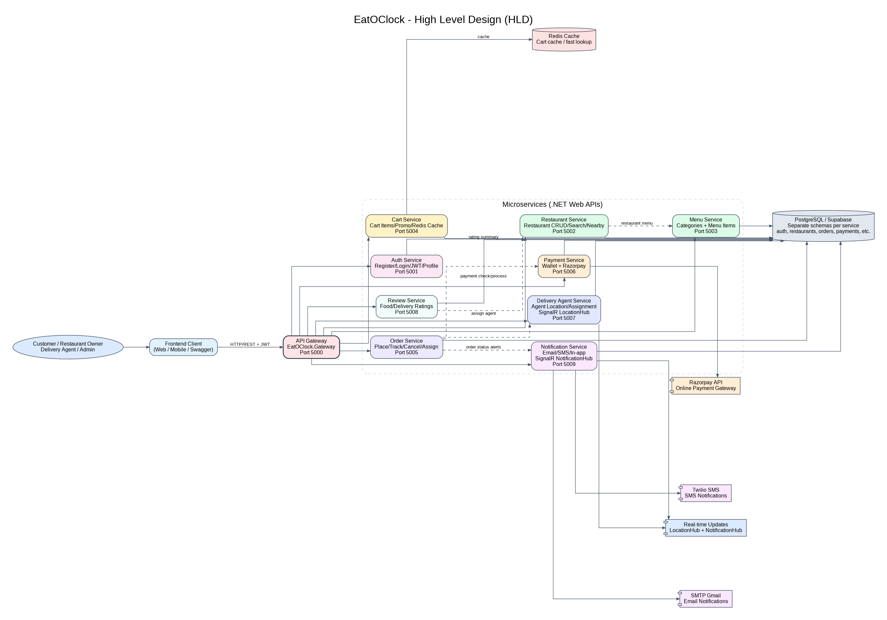
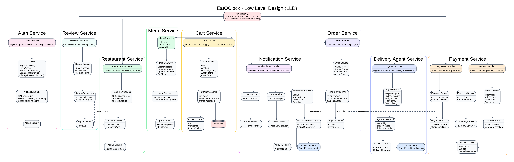
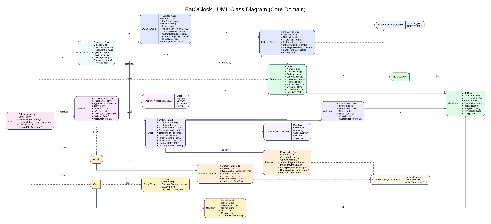

# 🍽️ EatOClock — Online Food Delivery Platform

> _Order Smarter. Eat Better. Delivered Faster._

EatOClock is a production-grade **microservices-based Online Food Delivery Platform** built with **ASP.NET Core (.NET 8)**. It connects **Customers**, **Restaurant Owners**, and **Delivery Agents** on a single unified backend, orchestrated through an API Gateway (YARP) and backed by **PostgreSQL (Supabase-hosted)**. Real-time delivery tracking is powered by **ASP.NET Core SignalR**.

---

## 📑 Table of Contents

- [About the Project](#about-the-project)
- [Tech Stack](#tech-stack)
- [System Architecture](#system-architecture)
- [Microservices Overview](#microservices-overview)
- [Core Features](#core-features)
- [System Architectural Diagram](#system-architectural-diagram)
- [Use Case Diagram](#use-case-diagram)
- [Microservices Communication Flow](#microservices-communication-flow)
- [ER Diagram](#er-diagram)
- [Project Flow Diagram](#project-flow-diagram)
- [Architecture Layers (Per Microservice)](#architecture-layers-per-microservice)
- [Project Structure](#project-structure)
- [API Endpoints (Per Service)](#api-endpoints-per-service)
- [Infrastructure Components](#infrastructure-components)
- [Installation & Setup](#installation--setup)
- [How to Run](#how-to-run)
- [How to Test](#how-to-test)
- [Database Schema](#database-schema)
- [Security Features](#security-features)
- [API Security](#api-security)
- [Performance Optimization](#performance-optimization)
- [Event-Driven Architecture](#event-driven-architecture)
- [API Documentation](#api-documentation)
- [Docker Configuration](#docker-configuration)
- [Roadmap](#roadmap)

---

## 🧭 About the Project

EatOClock is a **full-stack backend platform** inspired by Zomato and Swiggy, rebuilt from the ground up using modern ASP.NET Core patterns and clean microservices principles.

### The Problem It Solves

Traditional monolithic food delivery backends are hard to scale, deploy independently, or maintain at team level. EatOClock breaks every domain boundary into its own autonomous microservice — each with its own database, its own API surface, its own Docker container — connected through a single YARP-powered API Gateway that handles JWT authentication, rate limiting, and request routing transparently.

### What's Been Implemented

| Domain                                        | Status           |
| --------------------------------------------- | ---------------- |
| Authentication & User Management              | ✅ Implemented   |
| Restaurant Registration & Management          | ✅ Implemented   |
| Menu Categories & Items                       | ✅ Implemented   |
| Order Lifecycle (Place → Deliver)             | ✅ Implemented   |
| Delivery Agent Registration & Assignment      | ✅ Implemented   |
| Real-time Location (SignalR Hub)              | ✅ Implemented   |
| Redis Caching (Building Block)                | ✅ Implemented   |
| JWT Auth Middleware (Building Block)          | ✅ Implemented   |
| Health Checks (Building Block)                | ✅ Implemented   |
| Structured Logging - Serilog (Building Block) | ✅ Implemented   |
| EventBus (Stub / Foundation)                  | ✅ Stub in place |
| API Gateway (YARP)                            | ✅ Implemented   |
| Integration Tests                             | ✅ Implemented   |
| Cart Service                                  | ✅ Implemente    |
| Payment / Wallet Service                      | ✅ Implemented   |
| Notification Service                          | ✅ Implemented   |
| Review & Ratings Service                      | ✅ Implemented   |

### Architecture Philosophy

- **Database-per-Service** — every microservice owns its own PostgreSQL schema; no shared tables across services.
- **Single Responsibility** — each service has one bounded context and does exactly one job well.
- **Contract-First** — every service exposes a C# interface (`IXxxService`) that the controller depends on, not the concrete implementation.
- **Shared Nothing** — cross-service communication happens via **direct HTTP calls**, never shared memory or database joins.
- **Observability First** — every service plugs into the shared `Logging` building block (Serilog) and the `HealthChecks` building block at startup.

---

## 🛠️ Tech Stack

| Technology              | Purpose                                     |
| ----------------------- | ------------------------------------------- |
| ASP.NET Core 8 Web API  | Backend Microservices                       |
| YARP Reverse Proxy      | API Gateway & Routing                       |
| SignalR                 | Real-Time Notifications & Location Tracking |
| Supabase (PostgreSQL)   | Primary Database (per-service schemas)      |
| Entity Framework Core   | ORM & Migrations                            |
| Redis 7                 | Distributed Caching (Cart, Sessions)        |
| Razorpay                | Payment Gateway Integration                 |
| JWT (ASP.NET Identity)  | Authentication & Authorization              |
| Docker & Docker Compose | Containerization & Orchestration            |
| Twilio                  | SMS Notifications                           |
| SMTP (Gmail)            | Email Notifications                         |
| xUnit                   | Unit & Integration Testing                  |
| Render.com              | Cloud Deployment                            |

---

## 🏗️ System Architecture

EatOClock follows a **microservices architecture** where every service is independently deployable, owns its own data store, and communicates through well-defined HTTP contracts routed via the API Gateway.

```

┌──────────────────────────────────────────────────────────────────────────────┐
│                              CLIENT LAYER                                    │
│                  Angular Frontend (localhost:4200 / Render)                  │
└────────────────────────────────┬─────────────────────────────────────────────┘
                                 │  HTTP/HTTPS + WebSocket (SignalR)
                                 │
┌────────────────────────────────▼─────────────────────────────────────────────┐
│                         API GATEWAY  (YARP)                                  │
│                    Port 5000  |  eatoclock-gateway.onrender.com              │
│     • Request Routing     • CORS (Angular origins)     • JWT Forwarding      │
│     • Legacy-path rewrite (/api/auth → /api/v1/auth)                        │
└──┬──────┬──────┬──────┬──────┬──────┬──────┬──────┬──────┬──────────────────┘
   │      │      │      │      │      │      │      │      │
 Auth  Rest.  Menu  Cart  Order  Pay  Deliv  Review Notif
 :5001 :5002  :5003 :5004 :5005 :5006 :5007  :5008  :5009
   │      │      │      │      │      │      │      │      │
   └──────┴──────┴──────┴──────┴──────┴──────┴──────┴──────┘
                              │
            ┌─────────────────┼──────────────────┐
            │                 │                  │
   ┌────────▼────────┐  ┌─────▼──────┐  ┌───────▼────────┐
   │  Supabase PG    │  │  Redis 7   │  │   Razorpay     │
   │  (per schema)   │  │  :6379     │  │   Payment GW   │
   │  auth_custom    │  │ Cart Cache │  │                │
   │  restaurants    │  │ Sessions   │  │  Wallet API    │
   │  orders         │  └────────────┘  └────────────────┘
   │  payments       │
   │  delivery       │  ┌────────────────────────────────┐
   │  analytics      │  │     External Services          │
   │  notifications  │  │  • Gmail SMTP (Email)          │
   └─────────────────┘  │  • Twilio (SMS)                │
                        │  • SignalR Hubs (WS)           │
                        └────────────────────────────────┘

```

---

## 🔬 Microservices Overview

### 1. Auth Service (:5051)

Handles all identity concerns: user registration, login, JWT issuance & refresh, profile management, password change, and account deactivation. Users carry a `Role` enum (`CUSTOMER / OWNER / AGENT / ADMIN`) that downstream services read from the JWT claims.

**Key files:** `AuthController.cs`, `AuthServiceImpl.cs`, `IAuthService.cs`, `User.cs`, `AppDbContext.cs`

---

### 2. Restaurant Service (:5052)

Manages restaurant profiles. Stores GPS coordinates for geo-proximity search, cuisine tags, delivery radius, minimum order amount, and estimated delivery time. Restaurants require **Admin approval** before becoming visible to customers.

**Key files:** `RestaurantController.cs`, `RestaurantService.cs`, `IRestaurantService.cs`, `Restaurant.cs`

---

### 3. Menu Service (:5053)

Owns the full menu structure for every restaurant. Organises items under `MenuCategory` entities. Items carry price, discounted price, availability toggle, veg/non-veg flag, calories, and tags. Supports keyword search and veg-only filtering.

**Key files:** `MenuController.cs`, `MenuService.cs`, `IMenuService.cs`, `MenuItem.cs`, `MenuCategory.cs`

---

### 4. Order Service (:5054)

The **central orchestration service**. Converts a placed order into an `Order` record with an immutable `OrderItem` snapshot. Manages the complete status lifecycle: `PLACED → CONFIRMED → PREPARING → PICKED_UP → DELIVERED / CANCELLED`. Calls the Delivery Service to assign agents.

**Key files:** `OrderController.cs`, `OrderServiceImpl.cs`, `IOrderService.cs`, `OrderModels.cs`

---

### 5. Delivery Agent Service (:5055)

Handles agent registration, availability toggling, order assignment, GPS location updates, delivery records, and ratings. Exposes a **SignalR Hub (`LocationHub`)** for real-time location streaming to customers.

**Key files:** `AgentController.cs`, `AgentServiceImpl.cs`, `IAgentService.cs`, `LocationHub.cs`, `AgentModels.cs`

---

### API Gateway (YARP :5000)

Single ingress point. Reads YARP route config from `appsettings.json`, validates JWT tokens, applies rate-limiting policies, and proxies requests to the correct downstream service. No business logic lives here.

**Key files:** `Program.cs`, `appsettings.json`

---

### Building Blocks (Shared Libraries)

| Library          | Purpose                                                          |
| ---------------- | ---------------------------------------------------------------- |
| `Authentication` | `JwtBearerExtensions` — one-line JWT setup for any service       |
| `Caching`        | `IRedisCache` — typed Redis interface for distributed caching    |
| `EventBus`       | Foundation stub for future async messaging (RabbitMQ / Azure SB) |
| `HealthChecks`   | Registers standard ASP.NET Core health check endpoints           |
| `Logging`        | Serilog configuration shared across all services                 |

---

## ✨ Core Features

### Authentication & Identity

- JWT Bearer token authentication with refresh token support
- Role-based access control (`Customer / Owner / Agent / Admin`)
- Profile update and password change
- Account deactivation

### Restaurant Discovery

- Search restaurants by city or cuisine
- Geo-proximity search using latitude/longitude (Haversine-like distance)
- Filter by open status and admin approval
- Full restaurant CRUD for owners

### Menu Management

- Hierarchical categories → items structure
- Toggle item availability in real time
- Veg / non-veg filtering
- Keyword search across menu items
- Discounted price field per item

### Order Lifecycle

- Place orders referencing restaurant + items with quantity
- Full status pipeline: `PLACED → CONFIRMED → PREPARING → PICKED_UP → DELIVERED`
- Cancel orders with request reason
- Assign delivery agent to order
- View order history by customer or restaurant

### Delivery & Real-time Tracking

- Agent registration with vehicle details
- Availability toggling (online / offline)
- GPS location updates stored per agent
- Real-time location streaming via **SignalR `LocationHub`**
- Delivery record with pickup time, delivery time, and customer rating
- Nearby agent search (distance-based)

### Admin Operations

- Approve / reject restaurant registrations
- Approve delivery agents
- Role-based endpoints locked behind `[Authorize(Roles="Admin")]`

---

## 🏗️ System Architecture Diagram

```
┌──────────────────────────────────────────────────────────────────────────────┐
│                              CLIENT LAYER                                    │
│                  Angular Frontend (localhost:4200 / Render)                  │
└────────────────────────────────┬─────────────────────────────────────────────┘
                                 │  HTTP/HTTPS + WebSocket (SignalR)
                                 │
┌────────────────────────────────▼─────────────────────────────────────────────┐
│                         API GATEWAY  (YARP)                                  │
│                    Port 5000  |  eatoclock-gateway.onrender.com              │
│     • Request Routing     • CORS (Angular origins)     • JWT Forwarding      │
│     • Legacy-path rewrite (/api/auth → /api/v1/auth)                        │
└──┬──────┬──────┬──────┬──────┬──────┬──────┬──────┬──────┬──────────────────┘
   │      │      │      │      │      │      │      │      │
 Auth  Rest.  Menu  Cart  Order  Pay  Deliv  Review Notif
 :5001 :5002  :5003 :5004 :5005 :5006 :5007  :5008  :5009
   │      │      │      │      │      │      │      │      │
   └──────┴──────┴──────┴──────┴──────┴──────┴──────┴──────┘
                              │
            ┌─────────────────┼──────────────────┐
            │                 │                  │
   ┌────────▼────────┐  ┌─────▼──────┐  ┌───────▼────────┐
   │  Supabase PG    │  │  Redis 7   │  │   Razorpay     │
   │  (per schema)   │  │  :6379     │  │   Payment GW   │
   │  auth_custom    │  │ Cart Cache │  │                │
   │  restaurants    │  │ Sessions  │  │  Wallet API    │
   │  orders         │  └────────────┘  └────────────────┘
   │  payments       │
   │  delivery       │  ┌────────────────────────────────┐
   │  analytics      │  │     External Services          │
   │  notifications  │  │  • Gmail SMTP (Email)          │
   └─────────────────┘  │  • Twilio (SMS)               │
                        │  • SignalR Hubs (WS)           │
                        └────────────────────────────────┘
```

---

## 🔄 Microservice Communication Flow

```
┌──────────┐                    ┌──────────────────────┐
│  Client  │                    │   API Gateway (YARP) │
└────┬─────┘                    └──────────┬───────────┘
     │                                     │
     │  1. POST /api/v1/auth/login         │
     ├────────────────────────────────────►│
     │                               ┌─────▼──────────┐
     │                               │  AuthService   │
     │                               │  Validates     │
     │                               │  Issues JWT    │
     │                               └─────┬──────────┘
     │  2. JWT { accessToken, refresh }    │
     │◄────────────────────────────────────┤
     │                                     │
     │  3. POST /api/v1/cart/items (JWT)   │
     ├────────────────────────────────────►│
     │                               ┌─────▼──────────┐
     │                               │  CartService   │
     │                               │  Redis Cache   │
     │                               └─────┬──────────┘
     │  4. Cart State                      │
     │◄────────────────────────────────────┤
     │                                     │
     │  5. POST /api/v1/orders (JWT)       │
     ├────────────────────────────────────►│
     │                               ┌─────▼──────────┐
     │                               │  OrderService  │
     │                               │  Saves to DB   │
     │                               └──┬──────┬──────┘
     │                                  │      │
     │                       HTTP call  │      │ HTTP call
     │                                  │      │
     │                      ┌───────────▼┐  ┌──▼──────────────────┐
     │                      │ Notif Svc  │  │  NotifSvc           │
     │                      │ /order     │  │  /restaurant-alert  │
     │                      └───────────┬┘  └──┬──────────────────┘
     │                                  │      │
     │                         ┌────────▼──────▼──────────┐
     │                         │     SignalR Hub           │
     │                         │ + Email (SMTP)            │
     │                         │ + SMS (Twilio)            │
     │                         └────────────────┬──────────┘
     │  6. Real-time push (WS)                  │
     │◄─────────────────────────────────────────┤
     │                                          │
     │  7. POST /api/v1/payments/process        │
     ├────────────────────────────────────────► │
     │                               ┌──────────▼──────┐
     │                               │  PaymentService │
     │                               │  Razorpay / Wlt │
     │                               └─────────────────┘
     │  Payment confirmation                    │
     │◄─────────────────────────────────────────┤
```

---

## 📊 Entity Relationship Diagram (All Services)

```
┌─────────────────────────┐
│          User           │  (auth_custom schema)
├─────────────────────────┤
│ PK  Id (string/GUID)    │
│     UserName            │
│     Email               │
│     PasswordHash        │
│     FullName            │
│     PhoneNumber         │
│     Role (Identity)     │
│     RefreshToken        │
│     RefreshTokenExpiry  │
│     IsActive            │
│     CreatedAt           │
└────────┬────────────────┘
         │ 1:N (OwnerId / CustomerId / UserId across services)
         │
         ├──────────────────────────────────────────────────────┐
         │                                                      │
┌────────▼─────────────┐          ┌──────────────────────────┐ │
│     Restaurant        │          │      DeliveryAgent        │ │
├──────────────────────┤          ├──────────────────────────┤ │
│ PK  Id (GUID)         │          │ PK  AgentId (GUID)       │ │
│     Name              │          │     UserId (FK→User.Id)  │ │
│     Description       │          │     FullName             │ │
│     Cuisine           │          │     Phone / Email        │ │
│     Address           │          │     VehicleType          │ │
│     Latitude          │          │     VehicleNumber        │ │
│     Longitude         │          │     CurrentLatitude      │ │
│     Rating            │          │     CurrentLongitude     │ │
│     ReviewCount       │          │     IsAvailable          │ │
│     OwnerId (FK)      │          │     IsVerified           │ │
│     IsApproved        │          │     AverageRating        │ │
│     IsActive          │          │     TotalDeliveries      │ │
│     OpeningTime       │          │     TotalEarnings        │ │
│     ClosingTime       │          │     CreatedAt            │ │
└─────────┬────────────┘          └─────────────┬────────────┘ │
          │ 1:N                                  │ 1:N          │
          │                                      │              │
┌─────────▼────────────┐          ┌─────────────▼────────────┐ │
│     MenuCategory      │          │      DeliveryRecord       │ │
├──────────────────────┤          ├──────────────────────────┤ │
│ PK  Id (GUID)         │          │ PK  DeliveryId (GUID)    │ │
│     Name              │          │ FK  AgentId              │ │
│     RestaurantId (FK) │          │     OrderId              │ │
│     OwnerId           │          │     CustomerId           │ │
└─────────┬────────────┘          │     PickupAddress        │ │
          │ 1:N                   │     DeliveryAddress      │ │
          │                       │     EarningsForDelivery  │ │
┌─────────▼────────────┐          │     Status (enum)        │ │
│      MenuItem         │          │     Rating / RatingNote  │ │
├──────────────────────┤          │     AssignedAt           │ │
│ PK  Id (GUID)         │          │     PickedUpAt           │ │
│ FK  CategoryId        │          │     DeliveredAt          │ │
│     RestaurantId      │          └──────────────────────────┘ │
│     Name              │                                       │
│     Description       │  ┌──────────────────────────────────┐ │
│     Price (numeric)   │  │           Cart                   │ │
│     ImageUrl          │  ├──────────────────────────────────┤ │
│     IsAvailable       │  │ PK  CartId (GUID)                │ │
│     IsVeg             │  │     CustomerId (FK→User.Id)◄─────┘ │
│     CreatedAt         │  │     RestaurantId (FK)            │
└─────────┬────────────┘  │     TotalPrice                   │
          │ (snapshot)     │     CreatedAt / UpdatedAt        │
          │                └──────────┬───────────────────────┘
          │                           │ 1:N
          │                ┌──────────▼───────────────────────┐
          │                │          CartItem                 │
          │                ├──────────────────────────────────┤
          │                │ PK  ItemId (GUID)                │
          └────────────────│ FK  CartId                       │
           (MenuItemId)    │     MenuItemId (snapshot ref)    │
                           │     Name / Price (snapshot)      │
                           │     Quantity                     │
                           │     Customization                │
                           └──────────────────────────────────┘

┌─────────────────────────┐          ┌────────────────────────────┐
│         Order            │          │        PromoCode            │
├─────────────────────────┤          ├────────────────────────────┤
│ PK  OrderId (GUID)       │          │ PK  Id (GUID)              │
│     CustomerId (FK)      │          │     Code                   │
│     RestaurantId (FK)    │          │     DiscountPercent        │
│     RestaurantName       │          │     IsActive               │
│     DeliveryAgentId (FK) │          │     ExpiresAt              │
│     TotalAmount          │          └────────────────────────────┘
│     Discount             │
│     FinalAmount          │          ┌────────────────────────────┐
│     ModeOfPayment        │          │         Payment             │
│     Status (enum)        │          ├────────────────────────────┤
│     DeliveryAddress      │          │ PK  PaymentId (GUID)       │
│     Notes                │◄────────►│ FK  OrderId               │
│     CancellationReason   │          │     CustomerId             │
│     CreatedAt / UpdatedAt│          │     Amount                 │
└───────────┬─────────────┘          │     Status (enum)          │
            │ 1:N                     │     Mode (enum)            │
            │                         │     RazorpayOrderId        │
┌───────────▼─────────────┐          │     RazorpayPaymentId      │
│        OrderItem         │          │     FailureReason          │
├─────────────────────────┤          │     CreatedAt              │
│ PK  OrderItemId (GUID)   │          └────────────────────────────┘
│ FK  OrderId              │
│     MenuItemId (snapshot)│          ┌────────────────────────────┐
│     Name / Price         │          │          Wallet             │
│     Quantity             │          ├────────────────────────────┤
│     Customization        │          │ PK  WalletId (GUID)        │
└─────────────────────────┘          │     CustomerId             │
                                      │     Balance                │
┌─────────────────────────┐          └────────────┬───────────────┘
│         Review           │                       │ 1:N
├─────────────────────────┤          ┌─────────────▼──────────────┐
│ PK  ReviewId (GUID)      │          │      WalletStatement        │
│     OrderId (UNIQUE FK)  │          ├────────────────────────────┤
│     CustomerId (FK)      │          │ PK  StatementId (GUID)     │
│     RestaurantId (FK)    │          │ FK  WalletId               │
│     AgentId (FK?)        │          │     Type (enum)            │
│     FoodRating (1-5)     │          │     Amount                 │
│     DeliveryRating (1-5) │          │     Description            │
│     Comment              │          │     TransactionRef         │
│     IsActive             │          │     CreatedAt              │
│     CreatedAt / UpdatedAt│          └────────────────────────────┘
└─────────────────────────┘

┌─────────────────────────┐
│       Notification       │
├─────────────────────────┤
│ PK  Id (GUID)            │
│     RecipientId (FK)     │
│     Type (enum)          │
│     Title / Message      │
│     IsRead               │
│     PlaySound            │
│     CreatedAt            │
└─────────────────────────┘
```

---

## 🔁 Complete Order Flow — Sequence Diagram

```
Customer       Gateway       AuthSvc     CartSvc    OrderSvc    PaymentSvc   DeliverySvc  NotifSvc
   │              │             │            │          │             │             │           │
   │─ Register ──►│─────────────►│            │          │             │             │           │
   │◄─ JWT ───────┤◄────────────┤            │          │             │             │           │
   │              │             │            │          │             │             │           │
   │─ Browse Menu ►│             │            │          │             │             │           │
   │◄─ Items ─────┤             │            │          │             │             │           │
   │              │             │            │          │             │             │           │
   │─ Add to Cart ►│─────────────────────────►│          │             │             │           │
   │              │             │            │ Redis ↓  │             │             │           │
   │◄─ Cart State ─┤             │            │ persist  │             │             │           │
   │              │             │            │          │             │             │           │
   │─ Apply Promo ►│─────────────────────────►│          │             │             │           │
   │◄─ Discounted ─┤             │            │          │             │             │           │
   │              │             │            │          │             │             │           │
   │─ Place Order ►│─────────────────────────────────────►│             │             │           │
   │              │             │            │          │ Save DB     │             │           │
   │              │             │            │          │─────────────────────────────────────────►
   │              │             │            │          │             │             │ Push InApp│
   │              │             │            │          │             │             │ Send Email│
   │              │             │            │          │             │             │ Send SMS  │
   │◄─ Order ID ───┤             │            │          │             │             │           │
   │              │             │            │          │             │             │           │
   │─ Process Pmt ►│─────────────────────────────────────────────────►│             │           │
   │              │             │            │          │  Razorpay ↓ │             │           │
   │◄─ Pmt Status ─┤             │            │          │  or Wallet  │             │           │
   │              │             │            │          │             │             │           │
   │ (Restaurant accepts order)  │            │          │             │             │           │
   │              │             │            │          │◄─ Status:   │             │           │
   │              │             │            │          │  Confirmed  │             │           │
   │              │             │            │          │─────────────────────────────────────────►
   │              │             │            │          │             │             │ Notify    │
   │              │             │            │          │             │             │ Customer  │
   │              │             │            │          │             │             │           │
   │              │             │    (Admin assigns agent)            │             │           │
   │              │             │            │          │─────────────────────────►│           │
   │              │             │            │          │             │ Agent GPS  │           │
   │              │             │            │          │             │ Updates    │           │
   │              │             │            │          │             │ (SignalR)  │           │
   │              │             │            │          │             │             │           │
   │ (Agent delivers)           │            │          │             │             │           │
   │              │             │            │          │─────────────────────────────────────────►
   │              │             │            │          │             │             │ Delivered │
   │◄─ WS Push ────────────────────────────────────────────────────────────────────┤ Notif.   │
   │              │             │            │          │             │             │           │
   │─ Submit Review►│            │            │          │             │             │           │
   │              │             │            │      ReviewSvc                                  │
   │◄─ Rating Saved┤             │            │      (FoodRating + DeliveryRating)             │
```

---

## 🏛️ Clean Architecture Layers (Per Microservice)

```
┌────────────────────────────────────────────────────────────┐
│                        API LAYER                           │
│  Controllers/           Program.cs        Middleware       │
│  [Route] + [Authorize]  DI Registration   Error Handler   │
│  DTO Binding            JWT Validation    Health Check     │
└──────────────────────────┬─────────────────────────────────┘
                           │ calls
┌──────────────────────────▼─────────────────────────────────┐
│                   APPLICATION LAYER                        │
│  Interfaces/IXxxService   Services/XxxServiceImpl          │
│  Business Logic           Validation Rules                 │
│  DTO Mapping              Result Wrappers (AuthResult)     │
└──────────────────────────┬─────────────────────────────────┘
                           │ uses
┌──────────────────────────▼─────────────────────────────────┐
│                     DOMAIN LAYER                           │
│  Models/              Enums/                               │
│  (Order, Cart,        (OrderStatus, PaymentMode,           │
│   Payment, Review…)    VehicleType, DeliveryStatus…)       │
└──────────────────────────┬─────────────────────────────────┘
                           │ persisted by
┌──────────────────────────▼─────────────────────────────────┐
│                 INFRASTRUCTURE LAYER                       │
│  Data/AppDbContext        Migrations/                      │
│  EF Core + Supabase PG    JWT (ASP.NET Identity)           │
│  Redis (IRedisCache)      Razorpay SDK                     │
│  SignalR Hubs             SMTP EmailService                │
│  Twilio SmsService        HttpClientFactory (inter-svc)    │
└────────────────────────────────────────────────────────────┘
```

## 🏛 High-Level Design (HLD)



---

## 🔧 Low-Level Design (LLD)



---

## 🏛 Unified Modelling Language Diagram (UML)



---

## 📂 Project Structure

```
EatOClock/
│
├── API-Gateway/
│   └── EatOClock.Gateway/
│       ├── Program.cs                    # YARP + JWT + rate-limit setup
│       ├── appsettings.json              # Route config for all 5 services
│       └── Dockerfile
│
├── BuildingBlocks/
│   ├── Authentication/
│   │   └── JwtBearerExtensions.cs        # Shared JWT middleware
│   ├── Caching/
│   │   └── IRedisCache.cs               # Redis interface
│   ├── EventBus/
│   │   └── Class1.cs                    # EventBus stub
│   ├── HealthChecks/
│   └── Logging/                         # Serilog config
│
├── Services/
│   ├── Auth_Service/
│   │   ├── Controllers/
│   │   │   ├── AuthController.cs
│   │   │   └── UpdateProfileRequest.cs
│   │   ├── Data/AppDbContext.cs
│   │   ├── DTOs/                        # LoginDTO, RegisterDTO, UserDTO, etc.
│   │   ├── Enums/AllowedRegistrationRole.cs
│   │   ├── Interfaces/IAuthService.cs
│   │   ├── Migrations/
│   │   ├── Models/User.cs
│   │   ├── Services/
│   │   │   ├── AuthServiceImpl.cs
│   │   │   └── AuthResult.cs
│   │   ├── Program.cs
│   │   └── Dockerfile
│   │
│   ├── Restaurant_Service/
│   │   ├── Controllers/RestaurantController.cs
│   │   ├── Data/AppDbContext.cs
│   │   ├── DTOs/                        # CreateRestaurantDTO, NearbySearchDTO, etc.
│   │   ├── Interfaces/IRestaurantService.cs
│   │   ├── Migrations/
│   │   ├── Models/Restaurant.cs
│   │   ├── Services/RestaurantService.cs
│   │   ├── Program.cs
│   │   └── Dockerfile
│   │
│   ├── Menu_Service/
│   │   ├── Controllers/MenuController.cs
│   │   ├── Data/AppDbContext.cs
│   │   ├── DTOs/                        # CreateCategoryRequest, CreateMenuItemRequest, etc.
│   │   ├── Interfaces/IMenuService.cs
│   │   ├── Migrations/
│   │   ├── Models/
│   │   │   ├── MenuCategory.cs
│   │   │   └── MenuItem.cs
│   │   ├── Services/MenuService.cs
│   │   ├── Program.cs
│   │   └── Dockerfile
│   │
│   ├── Order_Service/
│   │   ├── Controllers/OrderController.cs
│   │   ├── Data/AppDbContext.cs
│   │   ├── DTOs/                        # PlaceOrderRequest, UpdateStatusRequest, etc.
│   │   ├── Enums/OrderStatus.cs
│   │   ├── Interfaces/IOrderService.cs
│   │   ├── Migrations/
│   │   ├── Models/OrderModels.cs
│   │   ├── Services/OrderServiceImpl.cs
│   │   ├── Program.cs
│   │   └── Dockerfile
│   │
│   └── DeliveryAgent_Service/
│       ├── Controllers/AgentController.cs
│       ├── Data/AppDbContext.cs
│       ├── DTOs/                        # AgentDTOs, AssignOrderRequest, NearbyAgentDTO, etc.
│       ├── Enums/AgentEnums.cs
│       ├── Hubs/LocationHub.cs          # SignalR real-time hub
│       ├── Interfaces/IAgentService.cs
│       ├── Migrations/
│       ├── Models/AgentModels.cs
│       ├── Services/AgentServiceImpl.cs
│       ├── Program.cs
│       └── Dockerfile
│
├── Shared/
│   └── Shared.csproj                   # Shared DTOs / utilities across services
│
├── Tests/
│   └── EatOClock.Tests/
│       └── EatOClock.Tests.csproj
│
└── docker-compose.yml
```

---

## 🌐 API Endpoints & Swagger Testing

All services expose Swagger UI. Access locally at `http://localhost:{port}/swagger`.

### 🔑 AuthService — `http://localhost:5001/swagger`

| Method | Endpoint                                | Role              | Description                                                |
| ------ | --------------------------------------- | ----------------- | ---------------------------------------------------------- |
| POST   | `/api/v1/auth/register`                 | Public            | Register new user (Customer/RestaurantOwner/DeliveryAgent) |
| POST   | `/api/v1/auth/login`                    | Public            | Login → returns `accessToken` + `refreshToken`             |
| POST   | `/api/v1/auth/refresh`                  | Public            | Refresh expired access token                               |
| POST   | `/api/v1/auth/bootstrap-admin/{userId}` | Public (one-time) | Promote first admin (blocked if admin exists)              |
| POST   | `/api/v1/auth/assign-admin/{userId}`    | Admin             | Assign admin role to user                                  |
| GET    | `/api/v1/auth/profile`                  | Admin             | Get own profile                                            |
| GET    | `/api/v1/auth/user/{userId}`            | Admin             | Lookup user by ID                                          |
| PUT    | `/api/v1/auth/profile`                  | Admin             | Update name / phone                                        |
| POST   | `/api/v1/auth/change-password`          | Authenticated     | Change password                                            |
| DELETE | `/api/v1/auth/deactivate`               | Authenticated     | Soft-delete own account                                    |

**Swagger Test Flow:**

```
1. POST /register  → copy accessToken
2. Click "Authorize" → paste "Bearer <accessToken>"
3. GET /profile    → verify roles in response
```

---

### 🏪 RestaurantService — `http://localhost:5002/swagger`

| Method | Endpoint                                  | Role                   | Description                          |
| ------ | ----------------------------------------- | ---------------------- | ------------------------------------ |
| POST   | `/api/v1/restaurant`                      | RestaurantOwner, Admin | Create restaurant (pending approval) |
| GET    | `/api/v1/restaurant`                      | Public                 | List all approved restaurants        |
| GET    | `/api/v1/restaurant/{id}`                 | Public                 | Get restaurant details               |
| GET    | `/api/v1/restaurant/search`               | Public                 | Search by name/cuisine               |
| POST   | `/api/v1/restaurant/nearby`               | Public                 | Geo-search by lat/lng radius         |
| PUT    | `/api/v1/restaurant/{id}`                 | RestaurantOwner, Admin | Update restaurant info               |
| DELETE | `/api/v1/restaurant/{id}`                 | RestaurantOwner, Admin | Delete restaurant                    |
| POST   | `/api/v1/restaurant/{id}/approve`         | Admin                  | Approve pending restaurant           |
| POST   | `/api/v1/restaurant/{id}/reject`          | Admin                  | Reject restaurant                    |
| GET    | `/api/v1/restaurant/owner/my-restaurants` | RestaurantOwner        | Get own restaurants                  |

---

### 🍕 MenuService — `http://localhost:5003/swagger`

| Method | Endpoint                                  | Role                   | Description                               |
| ------ | ----------------------------------------- | ---------------------- | ----------------------------------------- |
| POST   | `/api/v1/menu/category`                   | RestaurantOwner, Admin | Create menu category                      |
| GET    | `/api/v1/menu/category/{restaurantId}`    | All                    | Get all categories + items for restaurant |
| POST   | `/api/v1/menu/item`                       | RestaurantOwner, Admin | Add menu item                             |
| PUT    | `/api/v1/menu/item/{itemId}`              | RestaurantOwner, Admin | Update menu item                          |
| DELETE | `/api/v1/menu/item/{itemId}`              | RestaurantOwner, Admin | Remove menu item                          |
| PATCH  | `/api/v1/menu/item/{itemId}/availability` | RestaurantOwner, Admin | Toggle available/unavailable              |

---

### 🛒 CartService — `http://localhost:5004/swagger`

| Method | Endpoint                          | Role            | Description                           |
| ------ | --------------------------------- | --------------- | ------------------------------------- |
| GET    | `/api/v1/cart`                    | Customer, Admin | View current cart                     |
| POST   | `/api/v1/cart/items`              | Customer, Admin | Add item (enforces single restaurant) |
| PUT    | `/api/v1/cart/items/{itemId}/qty` | Customer, Admin | Update item quantity                  |
| DELETE | `/api/v1/cart/items/{itemId}`     | Customer, Admin | Remove item                           |
| DELETE | `/api/v1/cart`                    | Customer, Admin | Clear entire cart                     |
| POST   | `/api/v1/cart/promo`              | Customer, Admin | Apply promo code                      |
| POST   | `/api/v1/cart/switch-restaurant`  | Customer, Admin | Clear cart and switch restaurant      |

**Swagger Test Flow:**

```
1. POST /cart/items   { "menuItemId": "...", "name": "Burger", "price": 199, "quantity": 2 }
2. POST /cart/promo   { "promoCode": "SAVE10" }
3. GET  /cart         → verify discounted total
```

---

### 📦 OrderService — `http://localhost:5005/swagger`

| Method | Endpoint                           | Role                                  | Description                             |
| ------ | ---------------------------------- | ------------------------------------- | --------------------------------------- |
| POST   | `/api/v1/orders`                   | Customer, Admin                       | Place new order (triggers notification) |
| GET    | `/api/v1/orders/{id}`              | Authenticated                         | Get order by ID                         |
| GET    | `/api/v1/orders/customer`          | Customer, Admin                       | Get own order history                   |
| GET    | `/api/v1/orders/restaurant/{rId}`  | RestaurantOwner, Admin                | Get restaurant's orders                 |
| PUT    | `/api/v1/orders/{id}/status`       | RestaurantOwner, Admin, DeliveryAgent | Update order status                     |
| PUT    | `/api/v1/orders/{id}/cancel`       | Customer, Admin                       | Cancel order                            |
| POST   | `/api/v1/orders/{id}/reorder`      | Customer, Admin                       | Duplicate a past order                  |
| PUT    | `/api/v1/orders/{id}/confirm`      | Customer, Admin                       | Confirm order                           |
| PUT    | `/api/v1/orders/{id}/assign-agent` | Admin, RestaurantOwner, DeliveryAgent | Assign delivery agent                   |
| GET    | `/api/v1/orders/all`               | Admin                                 | Get all platform orders                 |
| GET    | `/api/v1/orders/available`         | Admin, DeliveryAgent                  | Orders awaiting agent pickup            |
| GET    | `/api/v1/orders/agent/{aId}`       | Admin, DeliveryAgent                  | Orders assigned to agent                |

---

### 💳 PaymentService — `http://localhost:5006/swagger`

**Payments (`/api/v1/payments`)**

| Method | Endpoint                           | Role            | Description                               |
| ------ | ---------------------------------- | --------------- | ----------------------------------------- |
| POST   | `/api/v1/payments/process`         | Customer, Admin | Process payment (Razorpay / Wallet / COD) |
| POST   | `/api/v1/payments/refund`          | Customer, Admin | Initiate refund                           |
| GET    | `/api/v1/payments/order/{orderId}` | Customer, Admin | Get payment for order                     |
| GET    | `/api/v1/payments/customer`        | Customer, Admin | Customer payment history                  |
| GET    | `/api/v1/payments/all`             | Admin           | All platform transactions                 |

**Wallet (`/api/v1/wallet`)**

| Method | Endpoint                        | Role            | Description                                          |
| ------ | ------------------------------- | --------------- | ---------------------------------------------------- |
| GET    | `/api/v1/wallet/balance`        | Customer, Admin | Get wallet balance                                   |
| POST   | `/api/v1/wallet/add`            | Customer, Admin | Add money (manual / test)                            |
| POST   | `/api/v1/wallet/topup/initiate` | Customer, Admin | Initiate Razorpay top-up → returns `razorpayOrderId` |
| POST   | `/api/v1/wallet/pay`            | Customer, Admin | Pay from wallet                                      |
| GET    | `/api/v1/wallet/statements`     | Customer, Admin | Transaction ledger                                   |

**Swagger Test Flow (Razorpay Top-up):**

```
1. POST /wallet/topup/initiate  { "amount": 500 }
   → copy razorpayOrderId
2. Complete payment on Razorpay test widget
3. GET /wallet/balance → verify balance increased
```

---

### 🛵 DeliveryAgentService — `http://localhost:5007/swagger`

| Method | Endpoint                                          | Role                   | Description                            |
| ------ | ------------------------------------------------- | ---------------------- | -------------------------------------- |
| POST   | `/api/v1/agents/register`                         | DeliveryAgent, Admin   | Register agent profile                 |
| GET    | `/api/v1/agents/{id}`                             | DeliveryAgent, Admin   | Get agent by ID                        |
| GET    | `/api/v1/agents/my-profile`                       | DeliveryAgent, Admin   | Get own profile                        |
| PUT    | `/api/v1/agents/{id}/verify`                      | Admin                  | Verify/approve agent                   |
| DELETE | `/api/v1/agents/{id}/reject`                      | Admin                  | Reject agent registration              |
| PUT    | `/api/v1/agents/{id}/availability`                | DeliveryAgent, Admin   | Toggle online/offline                  |
| PUT    | `/api/v1/agents/{id}/location`                    | DeliveryAgent, Admin   | Update GPS coordinates                 |
| GET    | `/api/v1/agents/{id}/orders`                      | DeliveryAgent, Admin   | View assigned orders                   |
| POST   | `/api/v1/agents/{id}/pickup/{orderId}`            | DeliveryAgent, Admin   | Mark order picked up                   |
| POST   | `/api/v1/agents/{id}/complete-delivery/{orderId}` | DeliveryAgent, Admin   | Mark delivered                         |
| GET    | `/api/v1/agents/{id}/earnings`                    | DeliveryAgent, Admin   | View earnings & delivery history       |
| GET    | `/api/v1/agents/nearby`                           | Admin, RestaurantOwner | Find agents within radius (lat/lng/km) |
| GET    | `/api/v1/agents/all`                              | Admin                  | List all registered agents             |
| POST   | `/api/v1/agents/{id}/assign`                      | DeliveryAgent, Admin   | Assign order to agent                  |
| PUT    | `/api/v1/agents/{id}/rating`                      | Admin                  | Update agent delivery rating           |

**SignalR Hub:** `ws://localhost:5007/hubs/location` — live GPS broadcast

---

### ⭐ ReviewService — `http://localhost:5008/swagger`

| Method | Endpoint                               | Role                                  | Description                                 |
| ------ | -------------------------------------- | ------------------------------------- | ------------------------------------------- |
| POST   | `/api/v1/reviews`                      | Customer, Admin                       | Submit review (FoodRating + DeliveryRating) |
| GET    | `/api/v1/reviews/restaurant/{rId}`     | Customer, RestaurantOwner, Admin      | All reviews for restaurant                  |
| GET    | `/api/v1/reviews/agent/{aId}`          | Customer, RestaurantOwner, Admin      | All reviews for agent                       |
| GET    | `/api/v1/reviews/order/{oId}`          | Admin, DeliveryAgent, RestaurantOwner | Review for specific order                   |
| PUT    | `/api/v1/reviews/{id}`                 | Customer, Admin                       | Edit own review                             |
| DELETE | `/api/v1/reviews/{id}`                 | Admin                                 | Moderate / remove review                    |
| GET    | `/api/v1/reviews/avg/restaurant/{rId}` | Customer, RestaurantOwner, Admin      | Average food rating                         |
| GET    | `/api/v1/reviews/avg/agent/{aId}`      | Customer, RestaurantOwner, Admin      | Average delivery rating                     |

---

### 🔔 NotificationService — `http://localhost:5009/swagger`

| Method | Endpoint                                 | Role            | Description                         |
| ------ | ---------------------------------------- | --------------- | ----------------------------------- |
| GET    | `/api/v1/notifications`                  | Customer, Admin | Get all notifications               |
| GET    | `/api/v1/notifications/unread-count`     | Customer, Admin | Badge count                         |
| PUT    | `/api/v1/notifications/{id}/read`        | Customer, Admin | Mark one as read                    |
| PUT    | `/api/v1/notifications/read-all`         | Customer, Admin | Mark all as read                    |
| DELETE | `/api/v1/notifications/{id}`             | Customer, Admin | Delete notification                 |
| POST   | `/api/v1/notifications/broadcast`        | Admin           | Platform-wide SignalR broadcast     |
| POST   | `/api/v1/notifications/order`            | Internal        | Order status → in-app + email + SMS |
| POST   | `/api/v1/notifications/restaurant-alert` | Internal        | New order alert to restaurant       |
| POST   | `/api/v1/notifications/send`             | Internal        | Generic in-app + email/SMS trigger  |
| POST   | `/api/v1/notifications/send-email`       | Internal        | Standalone email dispatch           |
| POST   | `/api/v1/notifications/send-sms`         | Internal        | Standalone SMS dispatch             |

**SignalR Hub:** `ws://localhost:5009/hubs/notifications` — real-time in-app push

---

## 🔐 Role-Based Access Control

| Role                | Permissions                                                                                                                  |
| ------------------- | ---------------------------------------------------------------------------------------------------------------------------- |
| **Customer**        | Browse, Cart, Order, Pay, Review, Notifications                                                                              |
| **RestaurantOwner** | Manage own restaurants & menus, view restaurant orders, find nearby agents                                                   |
| **DeliveryAgent**   | Register profile, toggle availability, update GPS, manage deliveries, view earnings                                          |
| **Admin**           | Full access — approve/reject restaurants & agents, moderate reviews, broadcast notifications, view all orders & transactions |

---

## 🗄️ Database Schema Map

| Schema (Supabase) | Service                        | Key Tables                                                 |
| ----------------- | ------------------------------ | ---------------------------------------------------------- |
| `auth_custom`     | AuthService                    | `AspNetUsers`, `AspNetRoles`, `AspNetUserRoles`            |
| `restaurants`     | RestaurantService, MenuService | `Restaurants`, `MenuCategories`, `MenuItems`               |
| `orders`          | CartService, OrderService      | `Carts`, `CartItems`, `PromoCodes`, `Orders`, `OrderItems` |
| `payments`        | PaymentService                 | `Payments`, `Wallets`, `WalletStatements`                  |
| `delivery`        | DeliveryAgentService           | `DeliveryAgents`, `DeliveryRecords`                        |
| `analytics`       | ReviewService                  | `Reviews`                                                  |
| `notifications`   | NotificationService            | `Notifications`                                            |

---

## 🏗️ Infrastructure Components

| Component     | Technology                | Purpose                                              |
| ------------- | ------------------------- | ---------------------------------------------------- |
| API Gateway   | YARP (Microsoft)          | Single ingress, routing, JWT validation              |
| Database      | PostgreSQL on Supabase    | Persistent relational storage (1 DB per service)     |
| Redis         | Redis Server              | Distributed caching via `IRedisCache` building block |
| SignalR       | ASP.NET Core SignalR      | Real-time WebSocket location push from `LocationHub` |
| Serilog       | Serilog + sinks           | Structured JSON logging (console + file)             |
| Health Checks | ASP.NET Core HealthChecks | `/health` endpoint per service                       |
| Docker        | Docker + Compose          | Container packaging for all services                 |
| SonarQube     | SonarQube scanner         | Static code analysis and quality gate                |

---

## 🚀 Getting Started

### Prerequisites

- .NET 8.0 SDK
- Docker & Docker Compose
- Redis 7+
- Supabase account (or local PostgreSQL)
- Razorpay test account (for payment testing)
- Twilio account (for SMS)
- Gmail app password (for SMTP)

### Environment Variables

Create a `.env` file in the root directory:

```env
# JWT
JWT_KEY=mysecretkey1234567890mysecretkey1234567890
JWT_ISSUER=EatOClock
JWT_AUDIENCE=EatOClockUsers

# Supabase PostgreSQL (or local PG)
DB_HOST=aws-1-ap-southeast-2.pooler.supabase.com
DB_PORT=6543
DB_NAME=postgres
DB_USER=postgres.<project-ref>
DB_PASSWORD=your_db_password

# Razorpay
RAZORPAY_KEY_ID=rzp_test_xxxxxxxxxxxx
RAZORPAY_KEY_SECRET=xxxxxxxxxxxxxxxxxxxx

# Email (SMTP)
SMTP_USER=your@gmail.com
SMTP_PASS=your_app_password

# Twilio (SMS)
TWILIO_SID=ACxxxxxxxxxxxxxxxxxxxxxxxxxxxxxxxx
TWILIO_TOKEN=your_auth_token
```

### Option 1: Docker Compose (Recommended)

```bash
# Clone the repository
git clone https://github.com/yourusername/EatOClock.git
cd EatOClock

# Configure environment
cp .env.example .env
# Edit .env with your credentials

# Build and start all services
docker-compose up --build

# Services available at:
# Gateway:            http://localhost:5000
# AuthService:        http://localhost:5001/swagger
# RestaurantService:  http://localhost:5002/swagger
# MenuService:        http://localhost:5003/swagger
# CartService:        http://localhost:5004/swagger
# OrderService:       http://localhost:5005/swagger
# PaymentService:     http://localhost:5006/swagger
# DeliveryService:    http://localhost:5007/swagger
# ReviewService:      http://localhost:5008/swagger
# NotificationService:http://localhost:5009/swagger
```

### Option 2: Run Services Individually

```bash
# Start Redis
docker run -d -p 6379:6379 redis:7-alpine

# Run each service (separate terminals)
dotnet run --project Services/Auth_Service
dotnet run --project Services/Restaurant_Service
dotnet run --project Services/Menu_Service
dotnet run --project Services/Cart_Service
dotnet run --project Services/Order_Service
dotnet run --project Services/Payment_Service
dotnet run --project Services/DeliveryAgent_Service
dotnet run --project Services/Review_Service
dotnet run --project Services/Notification_Service
dotnet run --project API-Gateway/EatOClock.Gateway

# Run migrations (per service)
cd Services/Auth_Service && dotnet ef database update
```

### Health Checks

```bash
curl http://localhost:5000/health
# → { "status": "Healthy", "service": "Gateway", "time": "..." }
```

---

## 🧪 Testing

```bash
# Run all tests
cd Tests/EatOClock.Tests
dotnet test

# Run with coverage
dotnet test --collect:"XPlat Code Coverage"

# Generate coverage report
reportgenerator -reports:TestResults/*/coverage.opencover.xml -targetdir:coverage-report
```

### Sample API Test Requests

**Register & Login:**

```bash
# Register
curl -X POST http://localhost:5000/api/v1/auth/register \
  -H "Content-Type: application/json" \
  -d '{"fullName":"John Doe","email":"john@example.com","password":"Pass@1234","role":"Customer"}'

# Login
curl -X POST http://localhost:5000/api/v1/auth/login \
  -H "Content-Type: application/json" \
  -d '{"email":"john@example.com","password":"Pass@1234"}'
```

**Place Order (with JWT):**

```bash
curl -X POST http://localhost:5000/api/v1/orders \
  -H "Authorization: Bearer <JWT>" \
  -H "Content-Type: application/json" \
  -d '{
    "restaurantId": "<guid>",
    "items": [{"menuItemId":"<guid>","name":"Burger","price":199,"quantity":2}],
    "deliveryAddress": "123 Main St",
    "modeOfPayment": "Wallet"
  }'
```

**Add Money to Wallet:**

```bash
curl -X POST http://localhost:5000/api/v1/wallet/topup/initiate \
  -H "Authorization: Bearer <JWT>" \
  -H "Content-Type: application/json" \
  -d '{"amount": 500}'
```

---

## 🐳 Docker Port Reference

| Service              | Container Port | Host Port |
| -------------------- | -------------- | --------- |
| API Gateway          | 8080           | 5000      |
| AuthService          | 8080           | 5001      |
| RestaurantService    | 8080           | 5002      |
| MenuService          | 8080           | 5003      |
| CartService          | 8080           | 5004      |
| OrderService         | 8080           | 5005      |
| PaymentService       | 8080           | 5006      |
| DeliveryAgentService | 8080           | 5007      |
| ReviewService        | 8080           | 5008      |
| NotificationService  | 8080           | 5009      |
| Redis                | 6379           | 6379      |

---

## ☁️ Cloud Deployment (Render.com)

Each service is deployed as a separate Render Web Service using its Dockerfile. The Gateway routes to each service's Render URL.

```
Gateway:             https://eatoclock-gateway.onrender.com
Auth:                https://eatoclock.onrender.com
Restaurant + Menu:   https://eatoclock-restaurant.onrender.com
                     https://eatoclock-menu.onrender.com
Cart:                https://eatoclock-cart.onrender.com
Order:               https://eatoclock-order.onrender.com
Payment:             https://eatoclock-payment.onrender.com
Delivery:            https://eatoclock-delivery.onrender.com
Review:              https://eatoclock-review.onrender.com
Notification:        https://eatoclock-notif.onrender.com
```

> **Note:** Free-tier Render services cold-start after inactivity. The Gateway is configured with 3-minute HTTP timeouts to accommodate this.

---

### Health Checks

```bash
curl http://localhost:8081/health   # Auth
curl http://localhost:8082/health   # Restaurant
curl http://localhost:8083/health   # Menu
curl http://localhost:8084/health   # Order
curl http://localhost:8085/health   # Delivery
```

---

## 🗄️ Database Schema

> All databases are PostgreSQL. Each service owns one isolated schema / database.

### Auth Database — `eatoclock_auth`

```sql
CREATE TABLE users (
    id            UUID PRIMARY KEY DEFAULT gen_random_uuid(),
    full_name     TEXT NOT NULL,
    email         TEXT UNIQUE NOT NULL,
    password_hash TEXT NOT NULL,
    phone         TEXT,
    role          TEXT NOT NULL,          -- CUSTOMER | OWNER | AGENT | ADMIN
    provider      TEXT DEFAULT 'LOCAL',   -- LOCAL | GOOGLE | GITHUB
    is_active     BOOLEAN DEFAULT TRUE,
    profile_pic_url TEXT,
    created_at    TIMESTAMP DEFAULT NOW()
);
```

### Restaurant Database — `eatoclock_restaurants`

```sql
CREATE TABLE restaurants (
    id                    UUID PRIMARY KEY DEFAULT gen_random_uuid(),
    owner_id              UUID NOT NULL,
    name                  TEXT NOT NULL,
    description           TEXT,
    cuisine               TEXT,
    address               TEXT,
    city                  TEXT,
    latitude              DOUBLE PRECISION,
    longitude             DOUBLE PRECISION,
    phone                 TEXT,
    avg_rating            FLOAT DEFAULT 0.0,
    is_open               BOOLEAN DEFAULT FALSE,
    is_approved           BOOLEAN DEFAULT FALSE,
    delivery_radius       FLOAT,
    min_order_amount      DECIMAL(10,2),
    estimated_delivery_min INT
);
```

### Menu Database — `eatoclock_menu`

```sql
CREATE TABLE menu_categories (
    id            UUID PRIMARY KEY DEFAULT gen_random_uuid(),
    restaurant_id UUID NOT NULL,
    name          TEXT NOT NULL,
    description   TEXT,
    image_url     TEXT,
    display_order INT DEFAULT 0
);

CREATE TABLE menu_items (
    id               UUID PRIMARY KEY DEFAULT gen_random_uuid(),
    restaurant_id    UUID NOT NULL,
    category_id      UUID REFERENCES menu_categories(id),
    name             TEXT NOT NULL,
    description      TEXT,
    price            DECIMAL(10,2) NOT NULL,
    discounted_price DECIMAL(10,2),
    image_url        TEXT,
    is_veg           BOOLEAN DEFAULT FALSE,
    is_available     BOOLEAN DEFAULT TRUE,
    rating           FLOAT DEFAULT 0.0,
    calories         INT,
    tags             TEXT
);
```

### Order Database — `eatoclock_orders`

```sql
CREATE TABLE orders (
    id                    UUID PRIMARY KEY DEFAULT gen_random_uuid(),
    customer_id           UUID NOT NULL,
    restaurant_id         UUID NOT NULL,
    restaurant_name       TEXT,
    delivery_agent_id     UUID,
    total_amount          DECIMAL(10,2),
    discount              DECIMAL(10,2) DEFAULT 0,
    final_amount          DECIMAL(10,2),
    mode_of_payment       TEXT,           -- COD | ONLINE | WALLET
    status                TEXT NOT NULL,  -- PLACED | CONFIRMED | PREPARING | PICKED_UP | DELIVERED | CANCELLED
    order_date            TIMESTAMP DEFAULT NOW(),
    estimated_delivery    TIMESTAMP,
    delivery_address      TEXT,
    special_instructions  TEXT
);

CREATE TABLE order_items (
    id           UUID PRIMARY KEY DEFAULT gen_random_uuid(),
    order_id     UUID REFERENCES orders(id),
    menu_item_id UUID NOT NULL,
    name         TEXT NOT NULL,
    price        DECIMAL(10,2) NOT NULL,
    quantity     INT NOT NULL,
    customization TEXT
);
```

### Delivery Database — `eatoclock_delivery`

```sql
CREATE TABLE delivery_agents (
    id              UUID PRIMARY KEY DEFAULT gen_random_uuid(),
    user_id         UUID NOT NULL,
    vehicle_type    TEXT,        -- BIKE | CYCLE | CAR
    vehicle_reg_no  TEXT,
    is_available    BOOLEAN DEFAULT FALSE,
    is_approved     BOOLEAN DEFAULT FALSE,
    current_lat     DOUBLE PRECISION,
    current_lng     DOUBLE PRECISION,
    avg_rating      FLOAT DEFAULT 0.0,
    total_deliveries INT DEFAULT 0
);

CREATE TABLE delivery_records (
    id            UUID PRIMARY KEY DEFAULT gen_random_uuid(),
    order_id      UUID NOT NULL,
    agent_id      UUID REFERENCES delivery_agents(id),
    pickup_time   TIMESTAMP,
    delivery_time TIMESTAMP,
    rating        INT,
    notes         TEXT
);
```

---

## 🔒 Security Features

### JWT Authentication

- Short-lived access tokens (configurable, default 60 minutes)
- Refresh token support for seamless re-authentication
- Tokens carry `UserId`, `Email`, `Role` claims consumed by all downstream services
- The `Authentication` building block provides a one-liner `AddJwtBearerAuthentication()` extension that all services call at startup — consistent configuration, no duplication

### Role-Based Access Control (RBAC)

- Every sensitive endpoint is decorated with `[Authorize(Roles="...")]`
- Roles enforced: `Admin`, `Owner`, `Agent`, `Customer`
- The API Gateway validates JWT before the request ever reaches a service — invalid tokens are rejected at the edge

### Password Security

- Passwords are never stored in plaintext
- BCrypt hashing via ASP.NET Core's `PasswordHasher<T>`

### CORS

- Each service configures CORS policies in `Program.cs` restricted to known origins

### Admin-Gated Operations

- Restaurant approval, agent approval, and user management are locked behind `[Authorize(Roles="Admin")]`
- No self-approval paths exist in the codebase

---

## 🔐 API Security

| Layer                 | Mechanism                                                                                              |
| --------------------- | ------------------------------------------------------------------------------------------------------ |
| **Transport**         | HTTPS (TLS) enforced in production Docker config                                                       |
| **Authentication**    | JWT Bearer (validated at Gateway + per-service)                                                        |
| **Authorisation**     | `[Authorize(Roles)]` attributes on every protected controller action                                   |
| **Rate Limiting**     | Configured in YARP API Gateway to prevent abuse                                                        |
| **Input Validation**  | Data annotations + model state validation on all DTOs                                                  |
| **SQL Injection**     | EF Core parameterised queries — no raw SQL                                                             |
| **Secret Management** | JWT secrets and DB connection strings via `appsettings.json` / environment variables — never committed |

---

## ⚡ Performance Optimization

### Redis Caching

The `Caching` building block (`IRedisCache`) is wired up across services to cache:

- Frequently accessed restaurant listings
- Menu data (changes infrequently)
- Agent availability snapshots

Cache-aside pattern: check Redis → on miss, hit DB → write-back to Redis with TTL.

### EF Core Optimizations

- `AsNoTracking()` on all read-only queries to skip change-tracker overhead
- Projection via `.Select()` to fetch only needed columns
- Indexed columns: `email` (users), `restaurant_id` (menu_items), `customer_id` (orders), `status` (orders)

### Async Everywhere

All controller actions and service methods are `async Task<T>` — no blocking calls, full use of the ASP.NET Core thread pool.

### Pagination (Roadmap)

Large collection endpoints (orders history, restaurant lists) are planned for cursor-based pagination in the next milestone.

---

## 📨 Event-Driven Architecture

EatOClock includes an **`EventBus` building block** as a foundation for async, decoupled inter-service communication. Currently a stub (`Class1.cs`), it is designed to be backed by **RabbitMQ** or **Azure Service Bus** in production.

**Planned event flows:**

```
Order Service  ──[OrderPlaced]──►  Notification Service (email/SMS)
Order Service  ──[OrderPlaced]──►  Restaurant Service (new order alert)
Order Service  ──[OrderCancelled]──►  Delivery Service (release agent)
Auth Service   ──[UserDeactivated]──►  All services (revoke sessions)
```

**Why stub first?** Synchronous HTTP calls between services are simpler to debug in development. The EventBus interface is designed so the swap to a real message broker requires changing only the registration line in `Program.cs`, not any service logic.

---

## 📖 API Documentation

Each microservice ships with **Swagger / OpenAPI** enabled in development mode.

Access per service:

```
http://localhost:8081/swagger   → Auth Service
http://localhost:8082/swagger   → Restaurant Service
http://localhost:8083/swagger   → Menu Service
http://localhost:8084/swagger   → Order Service
http://localhost:8085/swagger   → Delivery Agent Service
```

All routes through the gateway:

```
http://localhost:5000/swagger   → Aggregated (if gateway aggregation is configured)
```

Swagger UI lets you:

- Browse all endpoints with request/response schemas
- Authenticate using the **Authorize** button (paste your JWT)
- Execute live requests directly from the browser

---

## 🐳 Docker Configuration

Each service has its own `Dockerfile`. The root `docker-compose.yml` (in `Menu_Service` directory, to be moved to root) orchestrates everything.

### Sample Dockerfile (per service)

```dockerfile
FROM mcr.microsoft.com/dotnet/aspnet:8.0 AS base
WORKDIR /app
EXPOSE 80

FROM mcr.microsoft.com/dotnet/sdk:8.0 AS build
WORKDIR /src
COPY . .
RUN dotnet restore "Services/Auth_Service/Auth-Service.csproj"
RUN dotnet build "Services/Auth_Service/Auth-Service.csproj" -c Release -o /app/build

FROM build AS publish
RUN dotnet publish "Services/Auth_Service/Auth-Service.csproj" -c Release -o /app/publish

FROM base AS final
WORKDIR /app
COPY --from=publish /app/publish .
ENTRYPOINT ["dotnet", "Auth-Service.dll"]
```

### docker-compose.yml (structure)

```yaml
version: "3.8"

services:
  api-gateway:
    build: ./API-Gateway/EatOClock.Gateway
    ports:
      - "5000:80"
    depends_on:
      - auth-service
      - restaurant-service
      - menu-service
      - order-service
      - delivery-service

  auth-service:
    build: ./Services/Auth_Service
    ports:
      - "8081:80"
    environment:
      - ConnectionStrings__DefaultConnection=Host=postgres;Database=eatoclock_auth;...
      - JwtSettings__Secret=${JWT_SECRET}

  restaurant-service:
    build: ./Services/Restaurant_Service
    ports:
      - "8082:80"
    environment:
      - ConnectionStrings__DefaultConnection=Host=postgres;Database=eatoclock_restaurants;...

  menu-service:
    build: ./Services/Menu_Service
    ports:
      - "8083:80"

  order-service:
    build: ./Services/Order_Service
    ports:
      - "8084:80"

  delivery-service:
    build: ./Services/DeliveryAgent_Service
    ports:
      - "8085:80"

  redis:
    image: redis:alpine
    ports:
      - "6379:6379"

  postgres:
    image: postgres:16-alpine
    environment:
      POSTGRES_USER: postgres
      POSTGRES_PASSWORD: ${POSTGRES_PASSWORD}
    volumes:
      - pgdata:/var/lib/postgresql/data

volumes:
  pgdata:
```

### Environment Variables

Create a `.env` file at the root (never commit this):

```env
JWT_SECRET=your-super-secret-key-minimum-32-characters
POSTGRES_PASSWORD=your-db-password
POSTGRES_HOST=localhost
```

---

## 🗺️ Roadmap

**Phase 1 — Completed ✅**

- User authentication with roles (Customer, Admin, RestaurantOwner, DeliveryAgent)
- Restaurant management with geo-search and admin approval
- Menu categories and item management
- Cart with single-restaurant enforcement, promo codes, Redis caching
- Full order lifecycle with status state machine
- Razorpay payment gateway + digital wallet
- Delivery agent GPS tracking via SignalR
- Review and rating system (food + delivery)
- Real-time notifications (in-app + email + SMS)
- YARP API Gateway with legacy-path rewriting
- Docker Compose orchestration
- Cloud deployment on Render.com

**Phase 2 — Planned 🚧**

- Order analytics dashboard (admin)
- Loyalty points system
- Scheduled delivery slots
- Multi-language support (i18n)
- Mobile app (Flutter/React Native)
- End-to-end integration test suite

---

## 📚 References

- [ASP.NET Core Documentation](https://docs.microsoft.com/aspnet/core)
- [YARP Reverse Proxy](https://microsoft.github.io/reverse-proxy/)
- [SignalR Documentation](https://docs.microsoft.com/aspnet/core/signalr)
- [Entity Framework Core](https://docs.microsoft.com/ef/core)
- [Razorpay .NET SDK](https://github.com/razorpay/razorpay-dotnet)
- [Supabase Documentation](https://supabase.com/docs)
- [Docker Documentation](https://docs.docker.com/)
